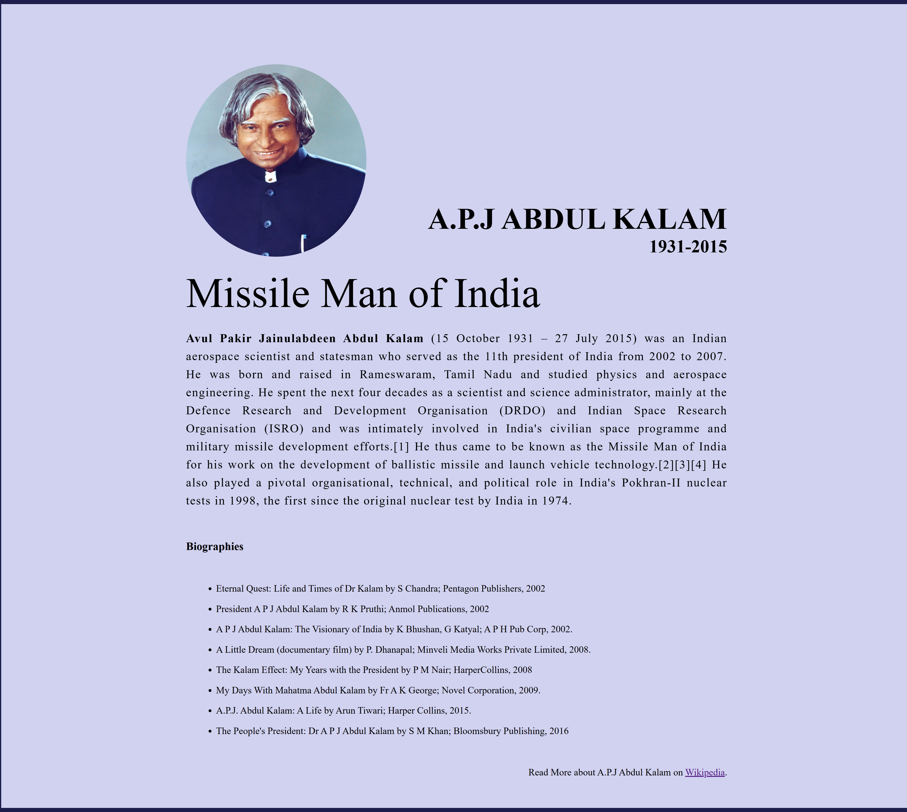

# Hello, World!

## This is a demo repository

### Welcome to my first Git Repository.

#### Feel free to explore and enjoy the journey of version control!

# First Git Repository

This is my first Git Repository. altafkhan098/demo-repository Folders and files Latest commit History Repository files navigation Hello, World! This is a demo repository Welcome to my first Git Repository. Feel free to explore and enjoy the journey of version control! Let's code, commit, and collaborate! Releases Packages Deployments 5 Languages

---

# Tribute Website to A.P.J Abdul Kalam

This is a tribute website dedicated to the life and achievements of **Dr. A.P.J Abdul Kalam**, the Missile Man of India, who served as the 11th President of India and made significant contributions to India's aerospace and defense capabilities.

## Table of Contents
- [About A.P.J Abdul Kalam](#about-apj-abdul-kalam)
- [Biographies](#biographies)
- [Further Reading](#further-reading)

## About A.P.J Abdul Kalam

**Avul Pakir Jainulabdeen Abdul Kalam** (15 October 1931 – 27 July 2015) was an Indian aerospace scientist and statesman who served as the 11th president of India from 2002 to 2007. 

Born in Rameswaram, Tamil Nadu, he studied physics and aerospace engineering. Dr. Kalam worked primarily at the **Defence Research and Development Organisation (DRDO)** and the **Indian Space Research Organisation (ISRO)**. He played a vital role in India's civilian space program and missile development efforts. He earned the title of **Missile Man of India** due to his contributions to the development of ballistic missile technology and the launch vehicle program. He also played a key role in India's **Pokhran-II nuclear tests** in 1998.

## Biographies

Below are some notable books and documentaries about the life and work of Dr. A.P.J Abdul Kalam:

- **Eternal Quest: Life and Times of Dr Kalam** by S Chandra (Pentagon Publishers, 2002)
- **President A.P.J Abdul Kalam** by R K Pruthi (Anmol Publications, 2002)
- **A.P.J Abdul Kalam: The Visionary of India** by K Bhushan & G Katyal (A.P.H. Pub Corp, 2002)
- **A Little Dream (documentary film)** by P. Dhanapal (Minveli Media Works Private Limited, 2008)
- **The Kalam Effect: My Years with the President** by P M Nair (HarperCollins, 2008)
- **My Days With Mahatma Abdul Kalam** by Fr A K George (Novel Corporation, 2009)
- **A.P.J. Abdul Kalam: A Life** by Arun Tiwari (Harper Collins, 2015)
- **The People's President: Dr. A.P.J Abdul Kalam** by S M Khan (Bloomsbury Publishing, 2016)

## Further Reading

For more information about the life and achievements of Dr. A.P.J Abdul Kalam, visit his [Wikipedia page](https://en.wikipedia.org/wiki/A._P._J._Abdul_Kalam).

---

## 🌟 Features

- **Clean, respectful design** fitting for a national hero
- **Responsive layout** that works from smartphones to rocketship dashboards
- **Key biographical information** about Dr. Kalam's incredible life
- **Complete bibliography** for further reading
- **0% missiles** (100% inspirational content)

---

## 🛠️ Tech Stack

| Technology | Usage | Importance |
|------------|-------|------------|
| HTML | Structure | 🌟🌟🌟🌟🌟 |
| CSS | Styling | 🌟🌟🌟🌟🌑 |
| Inspiration | From Dr. Kalam | 🌟🌟🌟🌟🌟🌟🌟 (infinite) |

---

## 📸 Screenshot
 

---
## How to Clone 🚀

### 1. Clone the Repository:
   - Open your terminal or command prompt.
   - Run this command to clone the repository to your local machine:
     ```bash
     git clone https://github.com/altafkhan098/demo-repository.git


### 2. Customize (Optional):
   - Feel free to modify the HTML, CSS, or JavaScript to add your own content or make changes!

---

### License

This website is a tribute to Dr. A.P.J Abdul Kalam. The content on this website is freely available for educational and informational purposes.

---

> "The best way to predict your future is to create it." – A.P.J Abdul Kalam  
> Also, a great way to spend your time is to create websites that honor great people... like this one. 😉
  
Remember, if you think you can’t create something amazing, just remember: **Dr. Kalam probably built rockets before breakfast**. 😄
